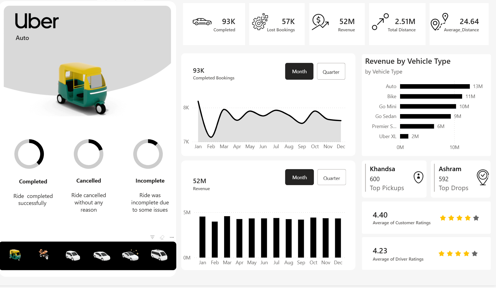
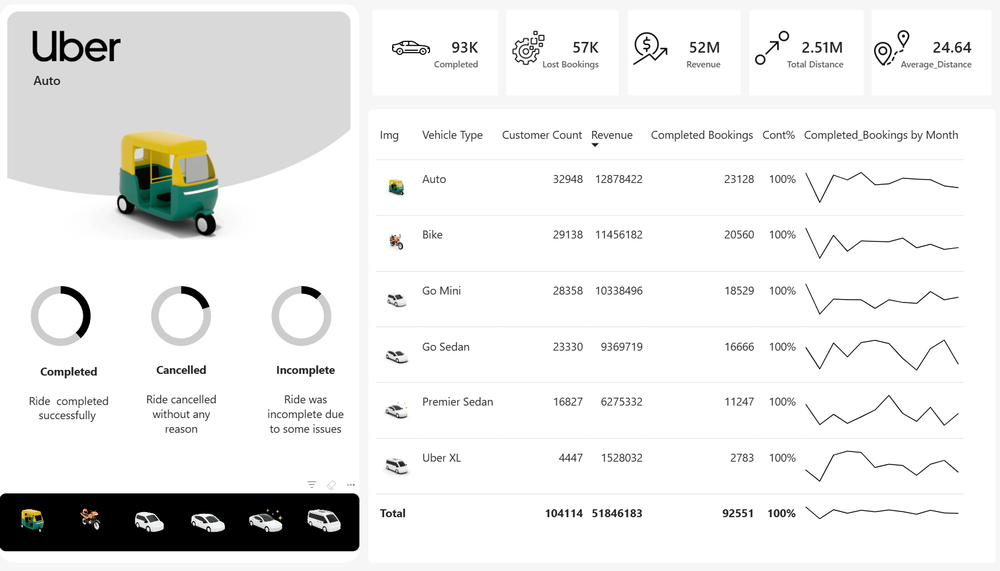
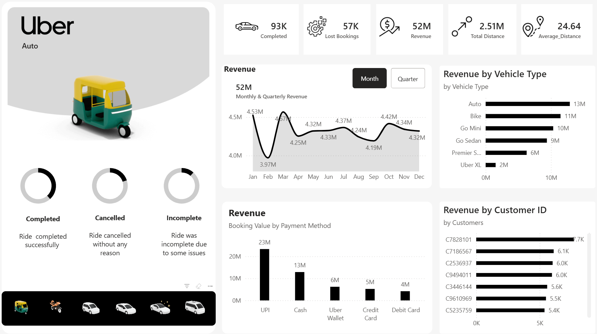
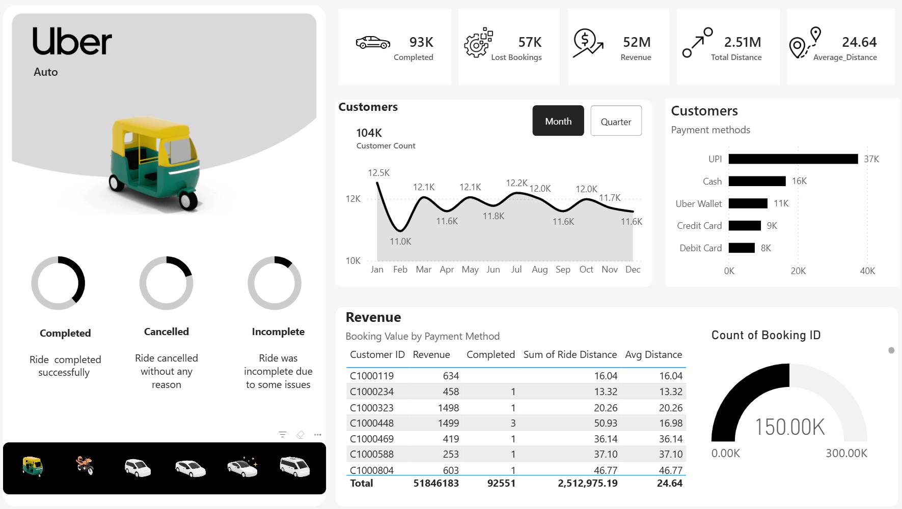
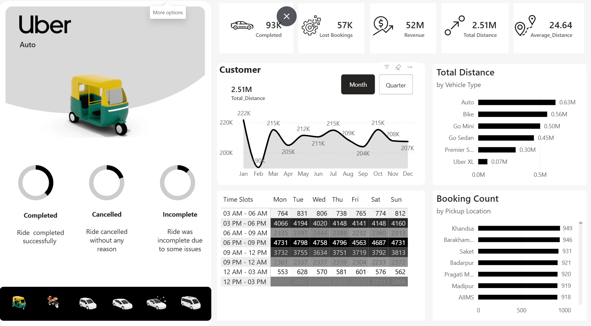

# 🚖 Uber Data Analysis Dashboard

### 📊 Power BI | Business Intelligence | Data Analytics

---

## 📌 Project Title
**Uber Data Analysis Dashboard using Power BI**

---

## 📝 Brief One Line Summary
An interactive dashboard analyzing Uber ride data to uncover insights on revenue, demand patterns, customer behavior, and operational efficiency.

---

## 📖 Overview
This project focuses on analyzing Uber ride data using Power BI to generate meaningful business insights. The dashboard provides a clear view of bookings, revenue, rider behavior, and demand trends through interactive visualizations.

---

## ❗ Problem Statement
Ride-sharing platforms generate large volumes of data, but extracting actionable insights is challenging.

This project aims to:
- Identify revenue-driving factors  
- Analyze customer behavior  
- Detect inefficiencies like cancellations  
- Understand demand across time and location  

---

## 📂 Dataset
The dataset contains:
- Booking status (Completed / Cancelled / Lost)  
- Revenue and trip distance  
- Vehicle type  
- Pickup & drop locations  
- Rider and driver ratings  
- Payment methods  
- Time-based data (monthly & quarterly)  

---

## 🛠️ Tools and Technologies
- Power BI  
- DAX (Data Analysis Expressions)  
- Data Modeling  
- Data Visualization  

---

## ⚙️ Methods
- Data Cleaning & Preprocessing  
- KPI Creation (Bookings, Revenue, Distance)  
- Time-based Analysis  
- Customer & Vehicle Segmentation  
- Interactive Dashboard Design  

---

## 🔍 Key Insights

### 🚀 Demand Patterns
Demand is concentrated in specific time slots and high-traffic locations.

### 💰 Revenue Distribution
A few vehicle categories contribute the majority of revenue.

### ❌ Lost Bookings
Lost bookings indicate missed revenue opportunities and operational inefficiencies.

### 👤 Customer Behavior
Returning and regular riders contribute significantly to consistent revenue.

### 💳 Payment Trends
Preferred payment methods influence booking completion rates.

### ⭐ Ratings Analysis
Ratings reflect service quality and customer satisfaction.

---

## 📊 Dashboard / Model / Output

### 🔹 Overview Dashboard
- KPIs: Bookings, Revenue, Distance  
- Monthly & Quarterly trends  
- Top locations  
- Ratings  

### 🔹 Vehicle Analysis
- Booking count by vehicle  
- Revenue contribution  

### 🔹 Revenue Analysis
- Revenue by customer, vehicle, and payment method  

### 🔹 Rider Analysis
- Cancellation reasons  
- Rider segmentation  

### 🔹 Location Analysis
- Busy areas  
- Peak time slots  

---

## 🖼️ Dashboard Preview

---

## ▶️ How to Run this Project

1. Download the `Sagar_Uber_project.pbit` file from this repository.
2. Open it using Power BI Desktop.
3. Load the dataset if prompted.
4. Navigate through the dashboard pages.
5. Use filters and slicers to explore insights.
---

## 📈 Results & Conclusion
The analysis shows that business performance depends heavily on demand patterns, customer retention, and vehicle efficiency.

Using these insights, businesses can:
- Improve operational efficiency  
- Optimize pricing strategies  
- Enhance customer experience  
- Increase revenue  

---

## 🔮 Future Work
- Real-time data integration  
- Predictive analytics  
- Machine learning models  
- Improved dashboard UI/UX  

---

## 👤 Author & Contact

**Sagar Kumar Barick**

  

---

## ⭐ Support
If you found this project useful, consider giving it a ⭐
